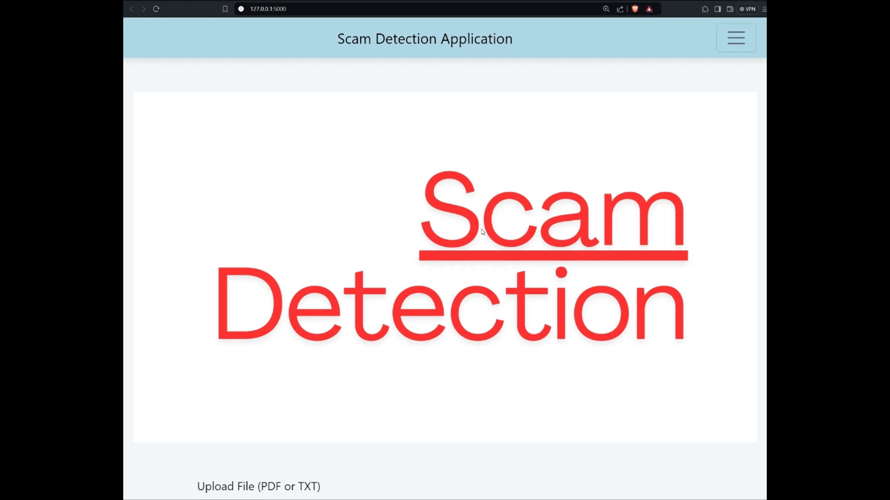
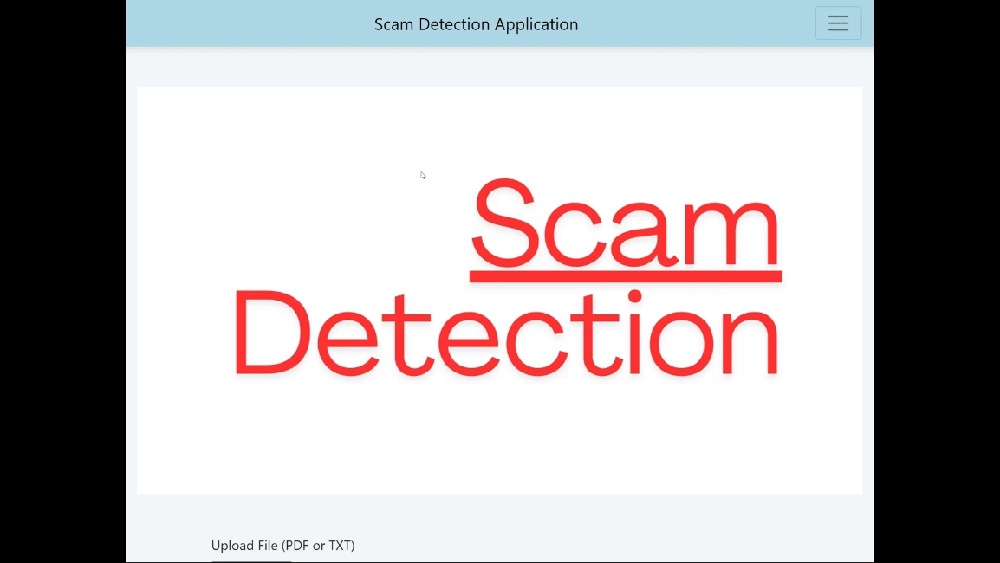
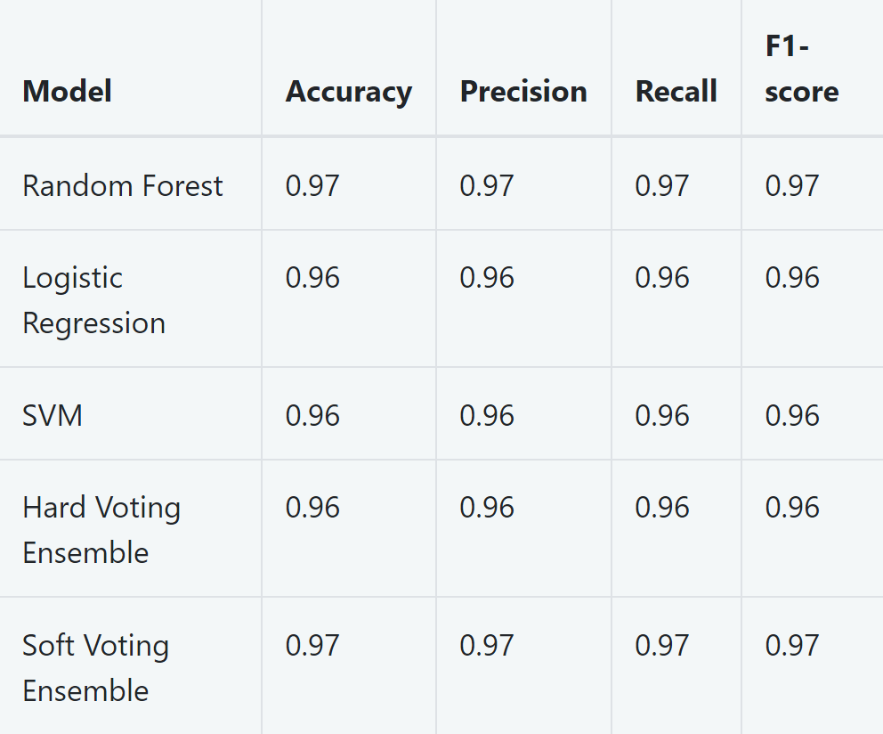
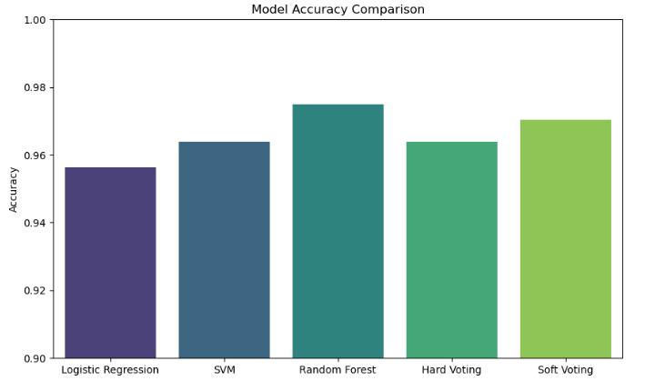
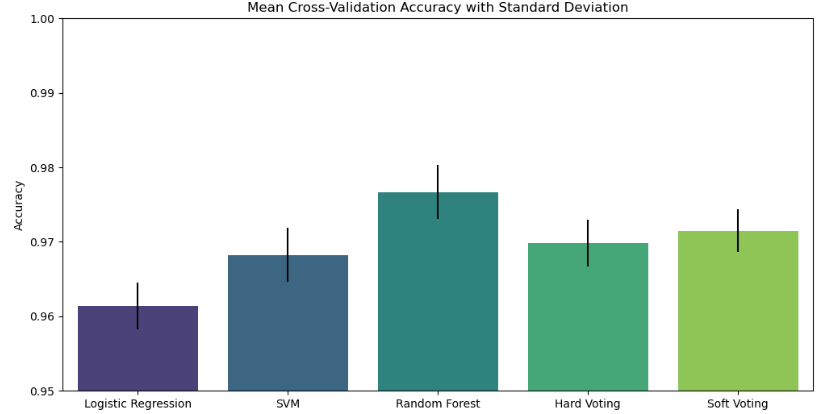

# Scam Detection Web Application

This is a Flask-based web application designed to detect scam text messages. It uses machine learning models to classify texts as scam or real. The application leverages advanced Natural Language Processing (NLP) techniques and machine learning algorithms to analyse and determine the nature of the text content. The models are trained on a variety of datasets containing examples of legitimate and fraudulent messages from [Mendeley Data](https://data.mendeley.com/datasets/f45bkkt8pr/1), ensuring high accuracy in detection. The web interface is built with user-friendliness in mind, providing a straightforward way for users to input text or upload files for scam detection.

## Demo of the web application


## How to upload txt or PDF file to detect?


## Table of Contents
- [Features](#features)
- [Installation](#installation)
- [Usage](#usage)
- [Running Tests](#running-tests)
- [Models Used](#models-used)
- [Model Results](#model-results)
- [Cross-Validation Results](#cross-validation-results)

## Features

1. **Detect Fake and Real Messages Using Algorithms**: The application classifies text messages as legitimate or fraudulent using trained machine learning models, including an ensemble of Logistic Regression, SVM, and Random Forest through soft voting.

2. **Gathering and Preprocessing of Dataset**: The application utilized datasets containing various types of messages. These datasets were cleaned and pre-processed to prepare them for model training.

3. **Text Preprocessing**: Preprocessing steps included cleaning the text to remove special characters, tokenizing the text, removing stopwords, and stemming.

4. **Training of Algorithms**: Logistic Regression, SVM, and Random Forest were trained. Ensemble methods like hard voting and soft voting were used to improve performance.

5. **Algorithm Accuracy in Detecting Scam or Real Text**: The models were evaluated for accuracy, precision, recall, and F1-score. The soft voting classifier was selected based on its balanced scores.

6. **Ensemble Learning Techniques**: The application utilized both hard voting and soft voting ensemble methods to combine predictions from multiple models, thereby improving the overall classification accuracy.

7. **Web Application Integration**: The Flask web application allows users to input text or upload files (PDF or TXT) for scam detection. The trained soft voting classifier predicts and displays the result on the web interface.

## Installation

### Prerequisites
- Python 3.11
- pip (Python package installer)

### Setup
1. **Clone the repository:**
    ```sh
    git clone https://github.com/AWXCiioa/ScamDetection.git
    cd ScamDetection
    ```

2. **Create a virtual environment:**
    ```sh
    python -m venv myenv
    ```

3. **Activate the virtual environment:**
    - On Windows:
        ```sh
        myenv\Scripts\activate
        ```
    - On macOS and Linux:
        ```sh
        source myenv/bin/activate
        ```

4. **Install the required packages:**
    ```sh
    pip install -r requirements.txt
    ```

## Usage

1. **Start the Flask application:**
    ```sh
    python app.py
    ```

2. **Open your web browser and go to:**
    ```
    http://127.0.0.1:5000
    ```

3. **Use the application:**
    - Navigate to the homepage to enter text or upload files for scam detection.
    - Change themes using the theme selector.
    - View results for the input text.

## Running Tests

### Unit Tests

Run unit tests using pytest:
```sh
pytest tests/test_unit.py -v
```

## Models Used
The following models were used in the web application to detect scam text messages:

### Logistic Regression:

The logistic regression model has a good mean accuracy but slightly lower than the other models. The standard deviation indicates consistent performance across folds.
### SVM:

The SVM model performs better than logistic regression, with a higher mean accuracy and similar consistency.
### Random Forest:

The Random Forest model shows the highest mean accuracy among individual classifiers, indicating strong performance. The slightly higher standard deviation suggests more variability across the folds compared to SVM.

### Hard Voting Classifier:

The hard voting classifier improves upon the individual classifiers' performances, but it's slightly lower than the soft voting classifier. The standard deviation is the lowest, indicating very consistent performance.

### Soft Voting Classifier:

The soft voting classifier shows a slight improvement over the hard voting classifier and most individual classifiers. The standard deviation is low, indicating consistent performance across folds.

## Model Results



## Cross-Validation Results

The models were evaluated using Stratified K-Fold Cross-Validation to ensure consistent performance across different subsets of the data. Below are the mean accuracy and standard deviation for each model:

| Model                      | CV Scores                                             | Mean CV Accuracy       | Standard Deviation of CV Accuracy |
|----------------------------|-------------------------------------------------------|------------------------|------------------------------------|
| Logistic Regression        | [0.96430108, 0.95655914, 0.96473118, 0.96215054, 0.95913978] | 0.9613763440860215     | 0.0031182054125405514             |
| SVM                        | [0.96645161, 0.96258065, 0.97032258, 0.96817204, 0.9711828]  | 0.967741935483871      | 0.0030655534935407464             |
| Random Forest              | [0.97376344, 0.9711828, 0.97806452, 0.97978495, 0.98064516]  | 0.9766881720430106     | 0.003633326809796602              |
| Hard Voting Classifier     | [0.96989247, 0.96473118, 0.97204301, 0.96860215, 0.9716129]  | 0.9693763440860215     | 0.0026289388025696483             |
| Soft Voting Classifier     | [0.97204301, 0.96602151, 0.97634409, 0.97376344, 0.97204301] | 0.9720430107526881     | 0.003397577231506474              |

## Model Results




The **Logistic Regression** model showed high accuracy, with precision, recall, and an F1-score all at **0.96**. Nonetheless, it did misclassify certain smishing and spam messages, as detailed in the misclassified samples table in the appendix. Similarly, the **Support Vector Machine (SVM)** model performed robustly, matching Logistic Regression with precision, recall, and an F1-score of **0.96**. However, it also struggled with some smishing and spam messages. The **Random Forest** model outperformed the others, achieving a precision of **0.98**, recall of **0.97**, and an F1-score of **0.97**, resulting in fewer misclassifications. The ensemble models, including both hard and soft voting classifiers, showed even better results. Notably, the **soft voting classifier** achieved the highest accuracy and the most balanced performance metrics.

